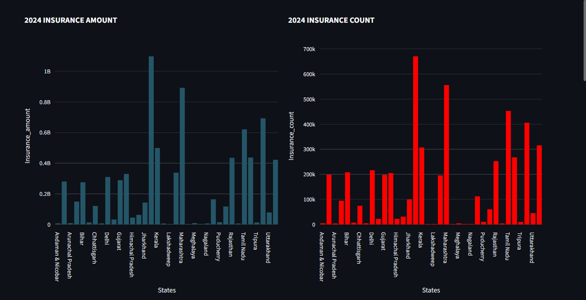
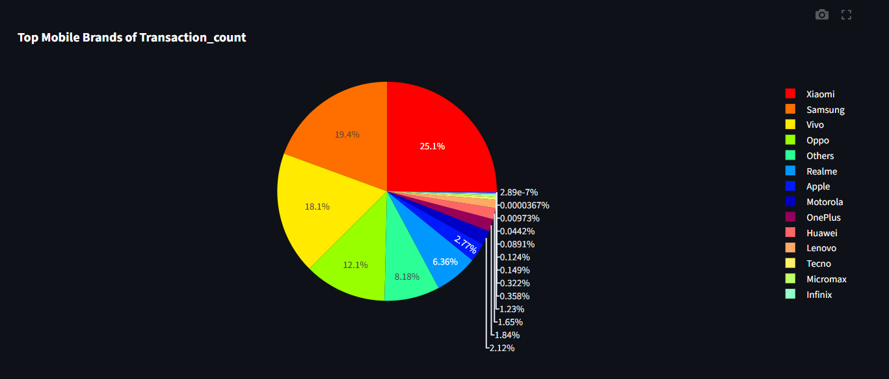

# 📊 PhonePe Transaction Insights Dashboard

A full-stack **data analytics and visualization project** built using **Streamlit** and **CockroachDB**, inspired by **PhonePe Pulse** open datasets.  
This dashboard enables interactive exploration of **transactions, insurance, and user metrics** across **India’s states and districts**, over multiple **years and quarters**.

This project is designed to showcase **data engineering, SQL, analytics, and visualization skills** and is suitable for **Data Science / Data Analyst / Data Engineer portfolios**.

---

## 🧠 Project Overview

The goal of this project is to:
- Ingest PhonePe Pulse–style data into a scalable SQL database
- Perform aggregations at **state, district, year, and quarter levels**
- Visualize insights interactively using **Streamlit + Plotly**
- Follow secure practices using **secrets management and SSL**

---

## 🚀 Key Features

### 📊 Aggregated Analysis
- Year-wise transaction & insurance analysis
- Quarter-wise drill-down
- Choropleth maps for India (state level)
- Transaction type distribution per state

### 🗺️ Map Analysis (District Level)
- State → District exploration
- Bar charts for:
  - Transaction amount
  - Transaction count
  - Insurance amount & count
- Pie charts for district-wise distribution

### 🔝 Top Charts
- Top & lowest transaction states
- Highest & lowest transaction districts
- Top mobile brands used
- Top PhonePe usage states

---

## 🖥️ App Preview

### 📊 Dashboard Overview

### 📈 Analytics & Insights View

---

## 🛠️ Tech Stack

| Category | Technology |
|-------|-----------|
| Frontend | Streamlit |
| Backend | Python |
| Database | CockroachDB (PostgreSQL compatible) |
| DB Connector | psycopg2 |
| Visualization | Plotly Express |
| Data Handling | Pandas |
| Security | SSL + Streamlit Secrets |
| Deployment Ready | Yes |

---

## 🗄️ Database Design

The project uses a **normalized relational schema** in CockroachDB:

### Tables Used
- `aggregated_transaction`
- `aggregated_insurance`
- `aggregated_user`
- `map_transaction`
- `map_insurance`
- `map_user`
- `top_transaction`
- `top_insurance`
- `top_user`

Each table supports:
- `states`
- `years`
- `quarter`
- Metric-specific columns (amounts, counts, users, etc.)
---

## 🔐 Secure Database Connection

Database credentials are **NOT hardcoded**.  
They are securely managed using **Streamlit Secrets**.

# 👤 Author

Praveen C
🎓 MSc Data Science & Artificial Intelligence (UK)
💼 Aspiring Data Scientist / Data Engineer
